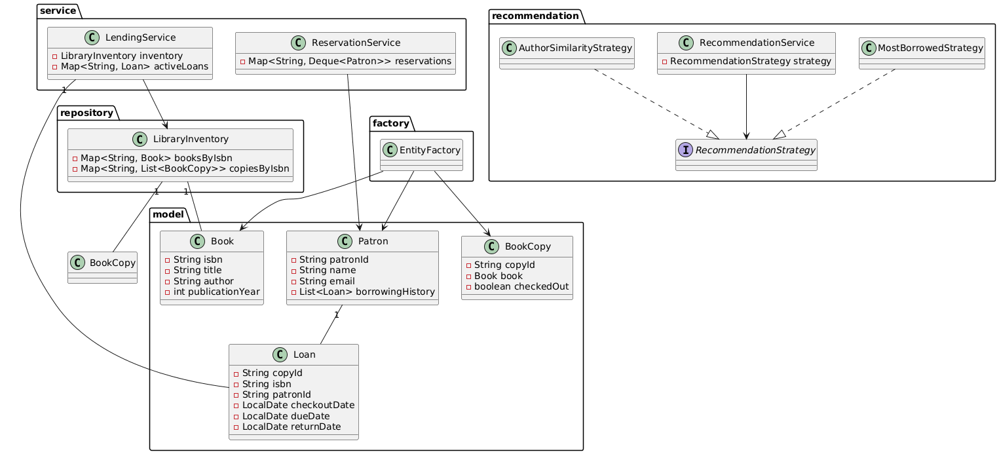

# Library Management System (Java) - README

## Overview
This project implements a simple Library Management System in Java focused on OOP design and SOLID principles. It provides basic book and patron management, lending (checkout/return), reservation notifications, and a pluggable recommendation system.

## Features
- Book and BookCopy modelling (title, author, ISBN, publication year).
- Inventory management: add, remove, search by title/author/ISBN.
- Patron management with borrowing history.
- Lending: checkout and return with loan history recording.
- Reservation system (Observer pattern): patrons can reserve checked out books and will be notified when available.
- Recommendation system (Strategy pattern) with pluggable strategies.
- Factory pattern for creating entities.
- Logging via `java.util.logging`.

## Design Patterns Used
- **Factory**: `EntityFactory`
- **Observer**: `ReservationService` (patron queue per ISBN; notifications when copies return)
- **Strategy**: `RecommendationStrategy` (pluggable recommendation algorithms)

## Project Structure
- `com.library.model` - domain classes: `Book`, `BookCopy`, `Patron`, `Loan`.
- `com.library.factory` - `EntityFactory`.
- `com.library.repository` - `LibraryInventory`.
- `com.library.service` - `LendingService`, `ReservationService`.
- `com.library.recommendation` - `Recommendation` strategies and `RecommendationService`.
- `com.library.util` - `LoggerConfig`.
- `com.library.App` - simple demo main.

## How to run
1. Compile all Java files (e.g., `javac`) ensuring package structure matches directories.
2. Run `com.library.App`.

## Class Diagram (PlantUML)
Paste the text below into a PlantUML renderer (or use an online PlantUML tool) to visualize the class diagram:

@startuml
package "model" {
class Book {
- String isbn
- String title
- String author
- int publicationYear
  }
  class BookCopy {
- String copyId
- Book book
- boolean checkedOut
  }
  class Patron {
- String patronId
- String name
- String email
- List<Loan> borrowingHistory
  }
  class Loan {
- String copyId
- String isbn
- String patronId
- LocalDate checkoutDate
- LocalDate dueDate
- LocalDate returnDate
  }
  }

package "repository" {
class LibraryInventory {
- Map<String, Book> booksByIsbn
- Map<String, List<BookCopy>> copiesByIsbn
  }
  }

package "service" {
class LendingService {
- LibraryInventory inventory
- Map<String, Loan> activeLoans
  }
  class ReservationService {
- Map<String, Deque<Patron>> reservations
  }
  }

package "factory" {
class EntityFactory
}

package "recommendation" {
interface RecommendationStrategy
class MostBorrowedStrategy
class AuthorSimilarityStrategy
class RecommendationService {
- RecommendationStrategy strategy
  }
  RecommendationService --> RecommendationStrategy
  MostBorrowedStrategy ..|> RecommendationStrategy
  AuthorSimilarityStrategy ..|> RecommendationStrategy
  }

LibraryInventory "1" -- " BookCopy"
LibraryInventory "1" -- "Book"
LendingService --> LibraryInventory
LendingService "1" -- "Loan"
Patron "1" -- "Loan"
ReservationService --> Patron

EntityFactory --> Book
EntityFactory --> BookCopy
EntityFactory --> Patron
@enduml

## Notes / Extensions
- Multi-branch support: inventory keyed by branch id; transfers implemented by removing/adding copies between branches.
- Persistence/DB: add DAO layer or integrate JPA / SQLite for real persistence.
- Notification: currently logs; swap in email/push service for production.

## Contributing
This is a demonstration project; extend it by adding:
- UI (console/web).
- Persistent storage.
- More advanced recommendation algorithms and caching.
